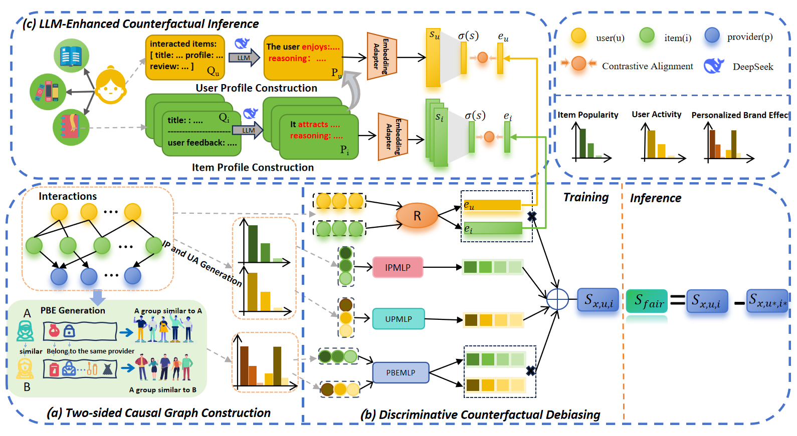

# Bridging Dual Fairness Gaps: LLM-enhanced Discriminative Counterfactual Debiasing for Recommendation

To bridge this dual fairness gap, we propose **LeadFairRec**, an LLM-Enhanced DiscriminAtive Counterfactual Debiasing Model for Two-
sided Fairness in Recommendation.


We first design a two-sided causal graph that jointly models provider-customer fairness interactions through their causal relationships. Then we propose a discriminative counterfactual debiasing method, which effectively removes spurious correlations while maintaining true user-item interactions. Finally, we propose an LLM-enhanced counterfactual inference method to derive noise-resistant user/item representations from interaction data, enhancing the robustness of causal debiasing.

## 📚 Dataset Description

As summarized in the following table, we select three public datasets, i.e., **Book-Crossing**, **Amazon Video Games** and **BeerAdvocate** to conduct experiments considering typical domains (books, games and beverages) and different scales (from thousands to millions). 

| Datasets | #Users  | #Items  | #Interactions | # Providers |
| -------  | ------- | ------- | ------------- | ----------- |
| 📖 Book-Crossing      |    6,400  | 8,496   | 106,918    | 607   |
| 🎮 Amazon_Video_Games |   44,189  | 14,752  | 394,832    | 1,621 |
| 🍺 BeerAdvocate       |   14,041  | 20,562  | 1,361,000  | 2,694 |

To evaluate the two-sided fairness, **publishers in book domain**, **companies in game domain** and **brewers in beer domain** are extracted from attribute information as the provider of items, which is consistent with the actual application scenario. 

## ✨ Quick Start

1. Unzip dataset files.
    ```bash
    cd dataset/Book-Crossing/; unzip Book-Crossing.zip
    cd dataset/Amazon_Video_Games/; unzip Amazon_Video_Games.zip
    cd dataset/BeerAdvocate/; unzip BeerAdvocate.zip
    ```
2. Install dependencies.
    ```bash
    pip install -r requirements.txt
    ```
3. Evaluate the performance of BPRMF model with and without our approach on Book-Crossing dataset.
    ```bash
    python run_model.py --model=LightGCN --dataset=Book-Crossing
    ```
  
## 🧐 Parameter Configurations

### Configuration files

Parameter configurations consist of three parts/files: 
- overall configuration ([[overall.yaml]](props/overall.yaml))
- dataset configuration (e.g., [[Book-Crossing.yaml]](props/Book-Crossing.yaml))
- model configuration (e.g., [[BPR.yaml]](props/BPR.yaml))

### General configurations
The training batch size is set to 4,096 and the embedding size is set to 64. We stop training when the performance on the validation set does not improve for 20 epochs, and NDCG@20 is set as the indicator. 

### Hyper-parameter tuning

The hyper-parameter tuning range of each model is located in the `hyper-range` folder. 

The example code for hyper-parameter tuning is as follows:

```bash
# For BPRMF model on the Book-Crossing dataset
python run_hyper.py --model=BPR --dataset=Book-Crossing --params_file=hyper-range/bpr.test --output_file=hyper_Book-Crossing_BPR.result
```

As for general parameters of all methods, we tune the learning rate in [1e-4,5e-4,1e-3,5e-3,1e-2] and the number of graph convolutional layers in [1,2,3].
We implement all models based on the open-source benchmark library RecBole \cite{24,25,26}. Since our method is model-agnostic, we select two representative methods, BPRMF \cite{bpr} and LightGCN \cite{lightgcn}, as the base recommenders. For the general parameters of all methods, we tune the learning rate in \{1\text{e-}4, 5\text{e-}4, 1\text{e-}3, 5\text{e-}3, 1\text{e-}2\} and the number of graph convolutional layers in [1,2,3]. For LeadFairRec, we set the $PBE$ coefficient $\gamma = -256$, the $IP$ coefficient $\delta = 64$, and the UA coefficient $\beta = 1$. In the LLM-enhanced causal inference module, we utilize the DeepSeek model and BERT to generate semantic representations for user and item profiles. For baselines, we carefully search the hyperparameters following the settings of the original authors.

- The experiments are conducted using the open-source recommendation library [RecBole](https://github.com/RUCAIBox/RecBole).
- Thanks for your reading and guidance. If you have any questions, please feel free to give me your advice.
